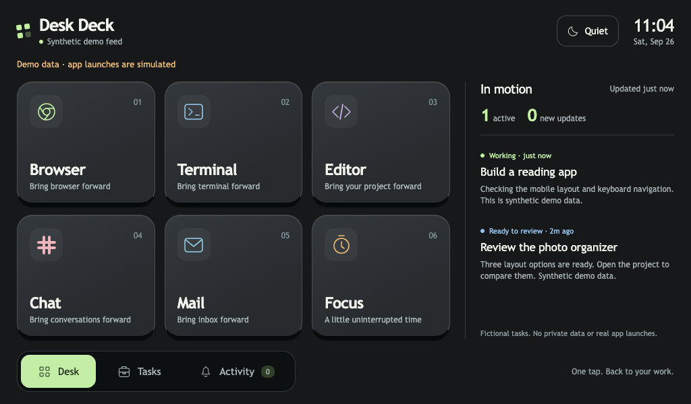

# Desk Deck

**Turn a Google Nest Hub into a touch control deck for your Mac.**

Big app buttons, live task updates, a quiet activity inbox, and a focus timer—served by a small web server on your own computer. Customize the buttons and connect your own scripts, builds, or workflows. Codex is optional.



## What it does

- Tap a tile to bring an application forward or open a configured link.
- See task progress with a timestamp and the latest message.
- Tap a task, inspect its update, and open its configured destination on your Mac.
- Collect new results in Activity. Quiet mode suppresses banners without losing updates.
- Start a 15, 25, or 50 minute focus timer; pause and resume across page reloads.

The main target is **Google Nest Hub + macOS**. It is a local web app: the Mac serves the interface, the Hub runs it, and touches send requests back to the Mac. The computer must remain awake and reachable. App controls activate apps; they do not enumerate or select arbitrary windows within an app.

## Set up your Nest Hub

You need Python **3.11 or newer**, a Mac, a Nest Hub, and a trusted LAN on which the Hub can reach the Mac. No Codex account, model API key, or cloud backend is required.

### 1. Get the project

```sh
git clone https://github.com/tianx-dev/desk-deck.git
cd desk-deck
python3 --version  # Must be 3.11 or newer.
python3 -m venv .venv
source .venv/bin/activate
python3 -m pip install -e '.[cast]'
```

### 2. Configure your own addresses

Find the Hub's IP in Google Home or your router. Find the Mac's LAN IP in System Settings → Network. On many Wi-Fi Macs, `ipconfig getifaddr en0` also works; use the interface actually connected to your LAN.

Set these two variables to **your real addresses**. The addresses below are documentation placeholders and will not work on your network.

```sh
DECK_LAN_IP='192.0.2.10'    # Replace with your Mac's LAN address.
NEST_HUB_IP='192.0.2.20'    # Replace with your Nest Hub's address.

python3 -m deskdeck init \
  --lan-host "$DECK_LAN_IP" \
  --device-host "$NEST_HUB_IP" \
  --device-name 'Desk display' \
  --enable-actions
```

This creates **`config.local.toml`**, containing your addresses and a generated pairing key. It is ignored by Git and created with owner-only permissions. Edit its launcher targets to match applications installed on your Mac. The default buttons are Browser, Terminal, Editor, Chat, Mail, and Focus.

### 3. Start the local server

```sh
python3 -m deskdeck serve --config config.local.toml
```

Leave that terminal running. If macOS asks whether Python may accept incoming connections, allow it on your trusted local network.

### 4. Cast the interface

In another terminal, from the same folder and virtual environment:

```sh
source .venv/bin/activate
python3 -m deskdeck cast --config config.local.toml
```

The Cast command replaces the current Cast app, opens the local page through the community **DashCast** receiver, and waits for a page heartbeat. A successful receipt includes the viewport size and reported touch points. **Tap a real tile next:** an app-launch acknowledgement alone does not prove touch works.

Keep both processes running. Ctrl-C stops each process; the Hub's Home gesture returns to its normal screen. Nothing installs itself at login.

## Connect real task progress

The default source is a local JSON file maintained by the `task` command. No coding agent is required. Run the commands below while the server and display are connected:

```sh
python3 -m deskdeck task --id website-build --title 'Website build' \
  --state active --message 'Running tests and generating the site.' \
  --open-url 'https://example.org/project'

# Run your actual build or workflow here.

python3 -m deskdeck task --id website-build --title 'Website build' \
  --state ready --message 'Build finished. Ready to review.'
```

Use your project's real destination instead of the example URL. The second update keeps the first destination. The display refreshes about every four seconds; the ready transition creates an Activity entry. A job that stays active should publish periodic updates. After three minutes without an update, its display state becomes Quiet.

See [task integrations](docs/integrations.md) for build-script patterns, the JSON contract, result semantics, and the optional Codex adapter.

## Customize it

- **Buttons:** edit `[[launchers]]` in your private config. Choose an installed app or an `http`, `https`, or `codex` link.
- **Task data:** use the CLI publisher, write the documented JSON shape atomically, or add a provider.
- **Appearance:** edit `deskdeck/web/style.css`; layout and interactions are in `index.html` and `app.js`. No frontend build step.
- **Other desktop systems:** the browser UI and synthetic preview can be used independently, but real launcher actions currently require macOS. The local task publisher uses POSIX file locking.

[Customization guide](docs/customization.md) · [How it works](docs/how-it-works.md) · [Build prompts](docs/prompts.md) · [Troubleshooting](docs/troubleshooting.md)

## Preview before connecting hardware

This is a development convenience; Nest Hub remains the primary device.

```sh
python3 -m deskdeck serve --demo
```

Open [the local preview](http://127.0.0.1:8765). It uses clearly labeled fictional tasks and simulated actions. One sample task finishes after 20 seconds, exercising the notification inbox. The preview never reads your Codex history or opens an application.

## Practical boundaries

- Intended for a **trusted private LAN**, not public hosting or an Internet tunnel. HTTP traffic is unencrypted. Read [SECURITY.md](SECURITY.md) before connecting private data.
- DashCast and the device's Cast/browser support are external dependencies. The optional Codex reader uses version-sensitive local records. See [compatibility and known limits](docs/troubleshooting.md).
- The server opens only configured targets or destinations from the current task feed. There is no arbitrary shell-command endpoint.
- A task marked ready is a report from its producer, not an independent verification of the underlying work.
- The activity inbox is in memory and resets on server restart. The generic task file persists locally.

## Development

```sh
python3 -m unittest discover -s tests -v
python3 scripts/check_public.py
```

See [verification details](docs/verification.md) and [CONTRIBUTING.md](CONTRIBUTING.md). This project began as a working Nest Hub experiment and was extracted into a configurable, sanitized implementation. The screenshot and examples contain synthetic data; the prompt guide is an edited reproduction recipe, not a raw conversation export.

MIT licensed. Unaffiliated with Google, OpenAI, or Elgato; product names identify compatible tools, not endorsements.
