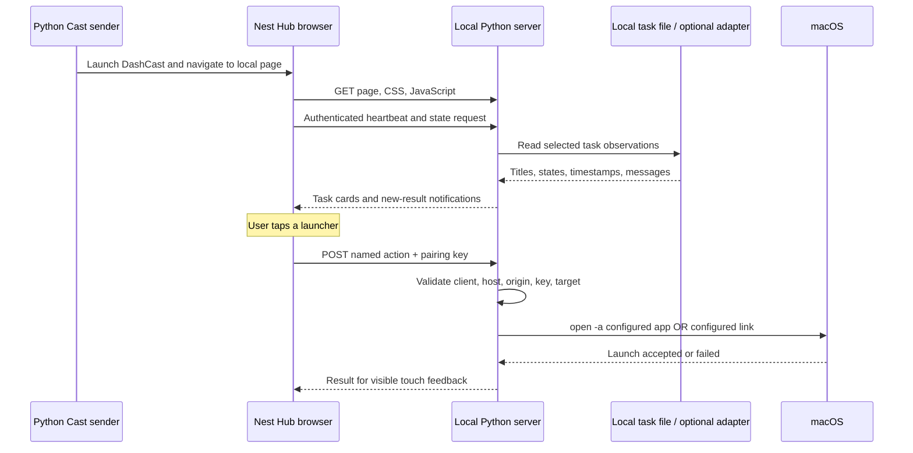

# How it works

Desk Deck is a local web application with a Cast launcher. The Nest Hub is both its display and its touch input device. The computer owns task data and the narrowly defined actions.



## 1. Getting the page onto the Hub

`deskdeck/casting.py` uses [PyChromecast](https://github.com/home-assistant-libs/pychromecast) to talk to the Cast service. It obtains the configured device's Cast identifier from its local setup endpoint, starts [DashCast](https://github.com/madmod/dashcast), and requests forced navigation to the locally hosted interface.

Force navigation matters: it loads our page directly instead of depending on an iframe. It also means the original receiver message handler is no longer available to load a second page. To refresh the deck through Cast, the command stops the previous Cast app and starts a new session.

The sender then waits for an **authenticated page heartbeat from the configured device IP**. That proves the Hub reached and executed our page. Reported touch points are encouraging; a physical tap and an observed action remain the end-to-end test.

This is a community receiver route, not a native app installed on the Hub. It does not require registering your own Cast receiver. Receiver hosting, firmware behavior, and long-session reliability may change. A self-hosted, registered custom receiver is a possible future transport; it is not implemented here. Google's [smart display guidance](https://developers.google.com/cast/docs/web_receiver/optimize-smart-displays) explains the official receiver touch model.

## 2. Display and touch

`deskdeck/web/` contains ordinary HTML, CSS, and JavaScript. The browser polls `/api/state` every four seconds and updates task cards. The launcher grid keeps fixed positions. Press feedback, large targets, bottom navigation, and visible offline state are designed around a 1024 × 600 touch display.

A tap submits an action id such as `open_app` and a target id such as `browser`. It does **not** submit a shell command. Quiet mode and the focus timer are UI behaviors; they do not modify macOS Focus settings.

## 3. Mac actions

The server resolves the id against the local configuration, then invokes an argument array such as:

```python
subprocess.run(['/usr/bin/open', '-a', 'Google Chrome'], ...)
```

There is no shell expansion or model interpretation. An app target activates that app; it does not select an arbitrary named window. A URL target opens the destination through macOS. For example, a Codex deep link can target a particular task, while a browser URL may open a new tab.

`enable_actions = false` makes actions simulated. The synthetic demo always simulates actions, even if someone accidentally enables that flag.

## 4. Task observations

The default `FileProvider` reads a small local JSON file. Your own scripts publish status with the `task` command. `publish.py` uses a file lock and atomic replacement so concurrent writers do not leave partially written JSON.

Each task supplies a stable id, title, state, timestamp, short message, completion id, and optional destination. The application does not calculate a fictional percentage or infer that a whole project succeeded.

The optional `CodexProvider` reads only explicitly selected local tasks. It opens SQLite in read-only mode, reads at most the last 2 MB of each selected session, and extracts user-visible assistant text. Reasoning and tool results are excluded. Message summaries are hidden unless enabled. This adapter is coupled to local record formats; a future adapter could use the documented [Codex app-server interface](https://learn.chatgpt.com/docs/app-server).

## 5. Notifications

The `Feed` establishes a baseline when the server starts. Old completions do not become a burst of notifications. A known task that produces a new completion id while ready creates one new Activity entry. Repeated polls do not duplicate it. Explicitly quiet updates do not notify.

The in-memory inbox supports acknowledgement and holds up to 30 items. Restarting the server resets that inbox. A future persistent inbox should store only normalized notification records, not copies of source session logs.

## 6. Pairing and trust

LAN setups generate a random pairing key into the ignored private config. The Cast launch URL carries it in a fragment. The browser stores it in session storage, removes it from the visible URL, and sends it as an Authorization header. Static assets contain no key.

Every data/action request checks the client IP, Host, bearer key, and supplied Origin; action requests require the expected Origin. See SECURITY.md for why this still belongs only on a trusted LAN and why DashCast is part of the trust boundary.

## Machine selection and the Mac app

The native companion starts the local server and sender as one owned process. The Hub’s machine picker resolves only configured peer ids, checks the selected peer through the restricted `/api/pair-check` route, then navigates to that Mac’s server. It does not proxy arbitrary requests or forward app commands between Macs. See [machine pairing](machines.md) and [the companion lifecycle](mac-app.md).

## Source map

| File | Responsibility |
|---|---|
| `cli.py` | Setup, serve, cast, and task-publishing commands |
| `config.py` | Machine-specific settings and launcher definitions |
| `casting.py` | Cast transport and display receipt verification |
| `server.py` | HTTP surface, pairing checks, action routing |
| `actions.py` | Restricted macOS application/link activation |
| `publish.py` | Atomic task updates from your scripts |
| `providers.py` | Demo, generic file, optional Codex sources; notification state |
| `web/` | Touch interface and local UI preferences |
